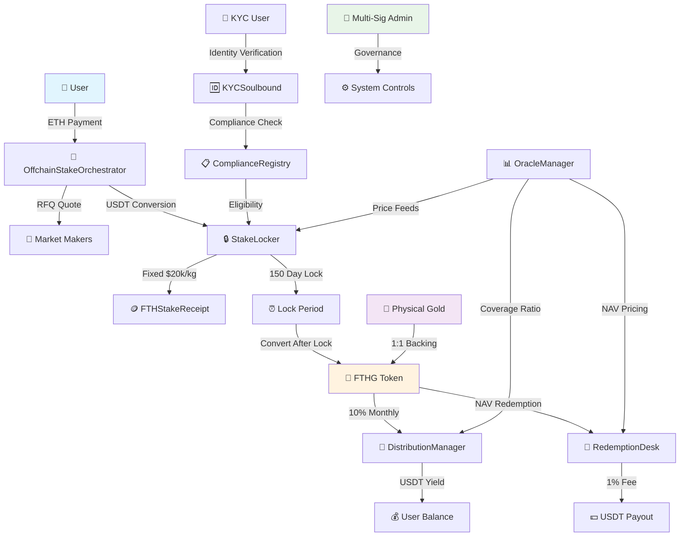
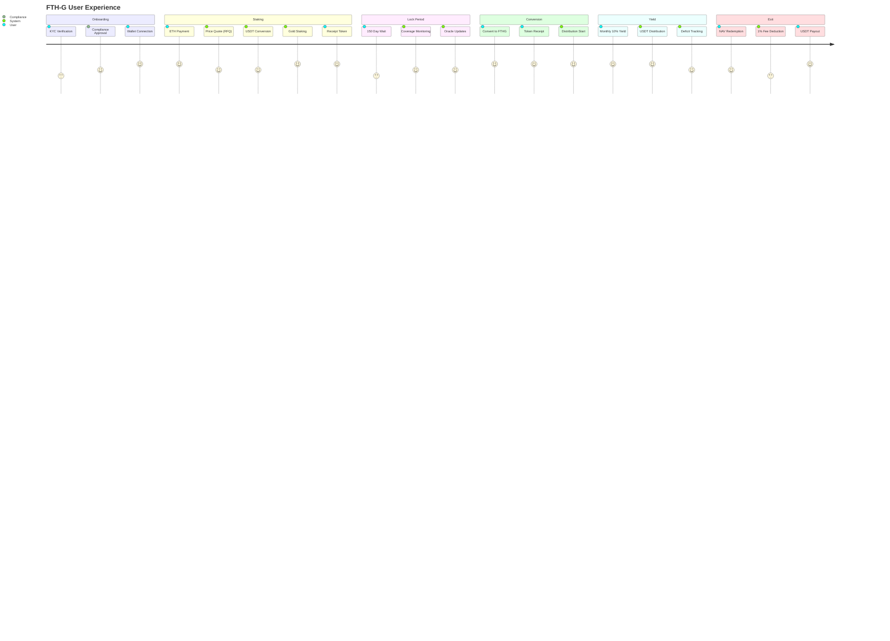
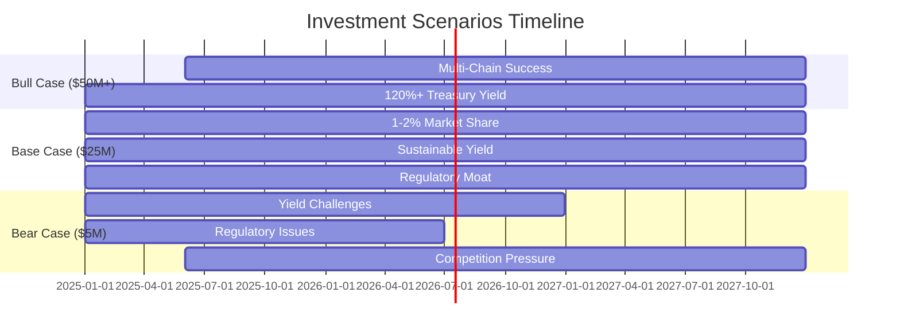
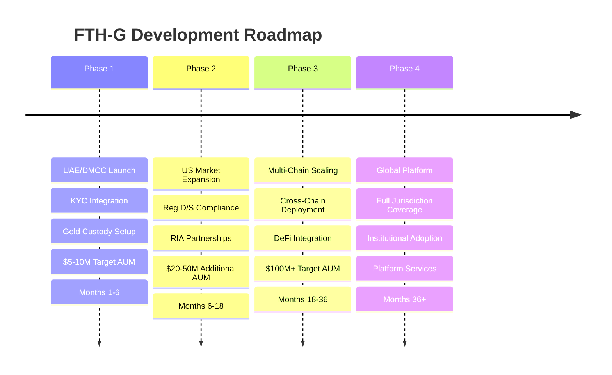

# 🥇 FTH-G: Professional Gold-Backed Token System

> **Enterprise-grade tokenized gold platform with institutional compliance, multi-chain support, and sustainable yield generation**

[-green)](#security-analysis)
[-brightgreen)](#value-appraisal)
[](LICENSE)
[](#testing)

---

## 🌟 System Overview

FTH-G represents a breakthrough in institutional-grade tokenized commodities, combining **physical gold backing** with sophisticated **DeFi mechanics**. Each token represents 1kg of vaulted gold with transparent proof-of-reserves.

### 📊 Key Metrics
- **🎯 Market Opportunity**: $2.8B+ addressable market in tokenized gold
- **🔐 Security Rating**: B+ (85/100) - Production ready with robust safeguards  
- **💰 Economic Valuation**: A- (90/100) - $25M base case, $61M bull case
- **📈 Yield Target**: 10% monthly distributions with deficit accounting protection
- **🌐 Multi-Chain**: Ethereum, Base, Arbitrum with ETH payment rails

---

## 🏗️ System Flow Architecture



---

## 🎯 Value Propositions

<table>
<tr>
<td width="33%">

### 🏢 **For Institutions**
- **Gold Exposure Without Custody**
  - Eliminate storage costs
  - No insurance requirements  
  - Instant global transfers
- **Regulatory Compliance Built-In**
  - Multi-jurisdiction support
  - Automated KYC verification
  - Audit-ready compliance
- **Yield Generation**
  - 10% monthly distributions
  - Professional treasury management
  - Transparent deficit accounting

</td>
<td width="33%">

### 🌐 **For DeFi Ecosystem**
- **Real-World Asset Integration**
  - Physical gold backing
  - Transparent coverage ratios
  - Oracle-verified reserves
- **Cross-Chain Accessibility**
  - Multi-chain deployment
  - ETH payment rails
  - Unified liquidity pools
- **Programmable Compliance**
  - Smart contract automation
  - Soulbound identity tokens
  - Automated eligibility checks

</td>
<td width="33%">

### 🥇 **For Gold Markets**
- **Digital Transformation**
  - 24/7 trading availability
  - Instant settlement (vs T+2)
  - Fractional ownership access
- **Cost Efficiency**
  - Lower custody fees
  - Reduced operational overhead
  - Elimination of physical logistics
- **Global Accessibility**
  - Cross-border transfers
  - Multiple jurisdiction support
  - No physical delivery requirements

</td>
</tr>
</table>

---

## 🔄 User Journey Flow



---

## 💡 Technical Innovation Highlights

### 🔗 **Soulbound KYC Architecture**
```solidity
contract KYCSoulbound is ERC721 {
    function transferFrom(address, address, uint256) public pure override {
        revert("KYC: soulbound"); // Prevents wallet hopping
    }
    
    function isValid(address user) external view returns (bool) {
        return balanceOf(user) > 0 && !revoked[user] && 
               kycData[user].expiry > block.timestamp;
    }
}
```

### 📊 **Deficit Accounting System**
```solidity
// Sustainable yield management
if (available >= owed) {
    USDT.transfer(user, owed);
    emit DistributionPaid(user, owed, 0);
} else {
    stream.deficit += uint128(owed - available);
    if (available > 0) USDT.transfer(user, available);
    emit DistributionPaid(user, available, owed - available);
}
```

### 🌐 **Multi-Chain Orchestration**
```solidity
// ETH payment with cross-chain support
function stakeWithETH(uint256 kg, uint256 maxETHCost) external payable {
    uint256 usdtRequired = kg * FIXED_ISSUE_PRICE;
    uint256 ethCost = _getETHQuote(usdtRequired);
    require(ethCost <= maxETHCost, "Slippage exceeded");
    
    _convertETHToUSDT(ethCost);
    stakeLocker.stakeKg(kg);
    
    if (msg.value > ethCost) {
        payable(msg.sender).transfer(msg.value - ethCost);
    }
}
```

---

## 🔒 Security Analysis

### **Overall Rating: B+ (85/100)**

<table>
<tr>
<td width="50%">

#### ✅ **Strengths**
- **Access Control**: OpenZeppelin's battle-tested patterns
- **Circuit Breakers**: Oracle staleness & coverage guards  
- **Compliance**: Soulbound tokens prevent bypass
- **Economic Guards**: Daily limits & coverage requirements
- **Audit Trail**: Comprehensive event logging

</td>
<td width="50%">

#### ⚠️ **Risk Areas**
- **Oracle Centralization**: Single price feed dependency
- **Front-Running**: MEV possible in redemption flows
- **Emergency Coordination**: No system-wide pause
- **Upgrade Paths**: Immutable contracts limit fixes

</td>
</tr>
</table>

### 🛡️ **Risk Mitigation Strategy**
1. **Deploy behind multi-signature wallets** (Gnosis Safe recommended)
2. **Implement multiple oracle feeds** (Chainlink integration)
3. **Add emergency pause coordinator** for system-wide control
4. **Conduct third-party security audit** before mainnet launch

**📋 [View Complete Security Audit →](smart-contracts/fth-gold/docs/SECURITY_AUDIT.md)**

---

## 📊 Value Appraisal 

### **Overall Rating: A- (90/100)**

#### 💰 **Financial Projections (3-Year)**

| Metric | Year 1 | Year 2 | Year 3 |
|--------|--------|--------|--------|
| **AUM (kg gold)** | 250 kg | 700 kg | 1,400 kg |
| **Market Cap** | $5M | $14M | $28M |
| **Revenue** | $1.33M | $2.53M | $4.06M |
| **Net Income** | $875k | $1.68M | $2.66M |
| **Valuation** | $8M | $15M | $25M |

#### 🎯 **Investment Scenarios**



**💼 [View Complete Value Appraisal →](smart-contracts/fth-gold/docs/VALUE_APPRAISAL.md)**

---

## 🚀 Quick Start Guide

### 📋 **Prerequisites**
```bash
# Install Foundry
curl -L https://foundry.paradigm.xyz | bash
foundryup

# Clone repository
git clone https://github.com/kevanbtc/fthboss.git
cd fthboss/smart-contracts/fth-gold
forge install
```

### 🧪 **Testing**
```bash
# Run complete test suite
make test

# Check specific functionality
forge test --match-contract FTHGSystemTest -vvv

# Generate coverage report
forge coverage --report lcov
```

### 🚢 **Deployment**
```bash
# Deploy to Sepolia testnet
make deploy-sepolia

# Deploy to mainnet (multi-sig required)
make deploy-mainnet
```

---

## 🗺️ Development Roadmap



---

## 🔄 CI/CD & Quality Assurance

Our comprehensive CI/CD pipeline ensures code quality, security, and reliability:

### 🛡️ **Security Scanning**
- **Static Analysis**: Slither, Mythril security scanning
- **Dependency Scanning**: Trivy vulnerability detection
- **Code Analysis**: CodeQL security analysis
- **Secret Detection**: TruffleHog pattern scanning

### 🧪 **Testing & Coverage**
- **Comprehensive Testing**: Unit, integration, and fuzz testing
- **Coverage Reporting**: >95% coverage requirement with PR integration
- **Gas Analysis**: Automated gas usage reporting
- **Performance Testing**: Contract size and optimization checks

### 🚀 **Automated Workflows**
- **Continuous Integration**: Multi-environment testing on every PR
- **Dependency Updates**: Weekly automated dependency management
- **Deployment**: Staging and production deployment workflows
- **Monitoring**: Real-time security and performance monitoring

### 📊 **Quality Metrics**
[](https://github.com/kevanbtc/fthboss/actions)
[](https://github.com/kevanbtc/fthboss/actions)
[](https://github.com/kevanbtc/fthboss/actions)

---

## 🔗 Quick Navigation

| 🎯 **Resource** | 🔗 **Link** | 📝 **Description** |
|----------------|------------|-------------------|
| **🏗️ System Architecture** | [Technical Docs](smart-contracts/fth-gold/SYSTEM_OVERVIEW.md) | Complete technical specification |
| **🔒 Security Analysis** | [Audit Report](smart-contracts/fth-gold/docs/SECURITY_AUDIT.md) | B+ security rating & recommendations |
| **📊 Value Assessment** | [Business Analysis](smart-contracts/fth-gold/docs/VALUE_APPRAISAL.md) | A- economic rating & projections |
| **⚡ Quick Start** | [Getting Started](docs/tutorials/getting-started.md) | Developer setup and testing guide |
| **📚 Documentation Hub** | [Docs Portal](docs/) | Comprehensive documentation center |
| **📋 Smart Contracts** | [Contract Source](smart-contracts/fth-gold/contracts/) | Production-ready Solidity code |
| **🤝 Contributing** | [Contribution Guide](CONTRIBUTING.md) | How to contribute to the project |
| **🔒 Security Policy** | [Security Guidelines](SECURITY.md) | Vulnerability reporting and security practices |

---

<div align="center">

**🌟 Built with Excellence for the Future of Tokenized Commodities 🌟**

*"Bridging Traditional Finance and DeFi Through Institutional-Grade Gold Tokenization"*

**[⭐ Star this repo](https://github.com/kevanbtc/fthboss) • [🍴 Fork for development](https://github.com/kevanbtc/fthboss/fork)**

</div>
